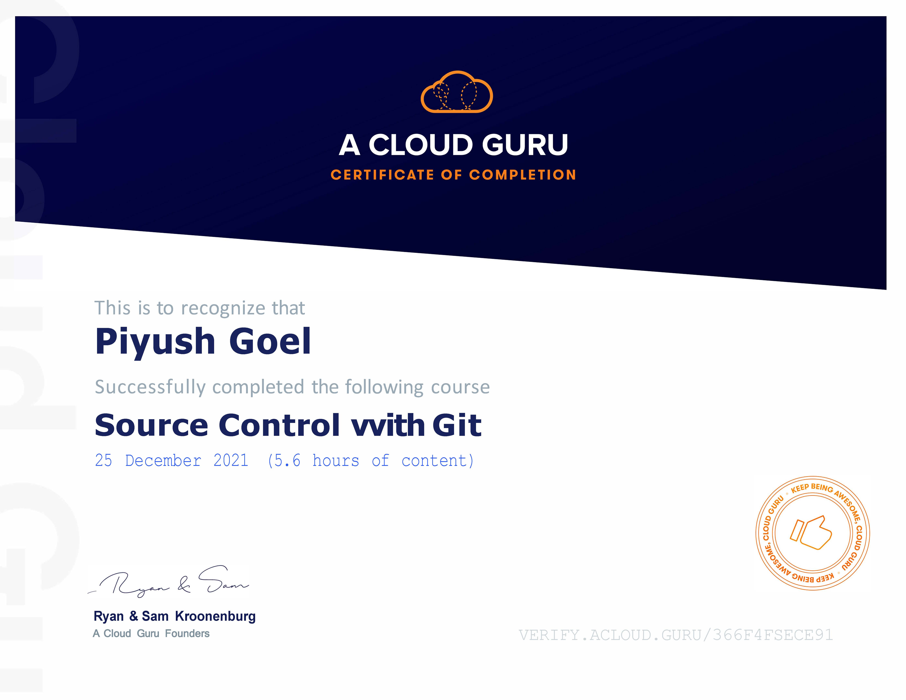

## Source Control with Git
This is an introductory course that will help someone new to Git get up and running with it quickly. We will show you the basics of working out of your own local repository, and then we will apply those skills to working with remote repositories such as the ones you would find on GitHub and BitBucket.

We will also see how we can install our own web-based Git server by using the free version of GitLab. So if you ever wanted to learn the basics of working with Git, this is the course for you.

## Content
1. Basics of Git.
2. Tags, Braching, Merging and Reverting
3. Git's Logs and Auditing
4. Cloning Repositories
5. Push, Pull, and Tracking Remote Repositories
6. Setting Up and Using a GitLab Server

[Verify Certificate](https://verify.acloud.guru/366F4F5ECE91)
