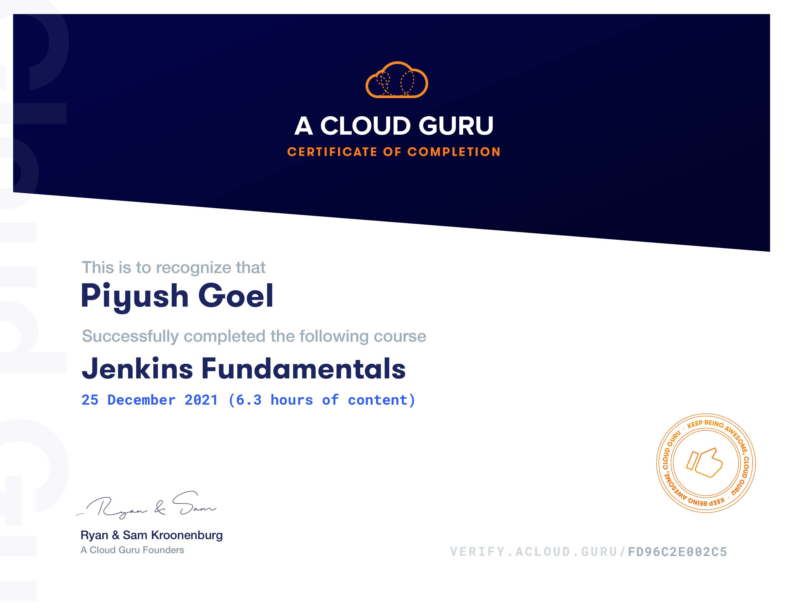

## Jenkins Fundamentals
In this course, we will cover the fundamentals of Jenkins, including continuous integration/continuous delivery (CI/CD) and continuous deployment. After that, we will move on to installing and configuring Jenkins, and get familiar with the graphical user interface. We will explore jobs and builds as well as build agents. This will give us the foundation we need to accomplish more complex Jenkins tasks. This course is part of the preparation for the Certified Jenkins Engineer 2020 exam.

## Courses
1. CI/CD Principles and Practices
2. Jenkins Installation
3. Jenkins Graphical User Interface
4. Jenkins Plugins
5. Freestyle Jobs
6. Agents and Distributed Builds
7. Source Code Management, Build Tools, and Test Reports
8. Upstream, Downstream, and Triggers
9. Jenkins on the Command Line

[Verify Certificate](https://verify.acloud.guru/FD96C2E002C5)