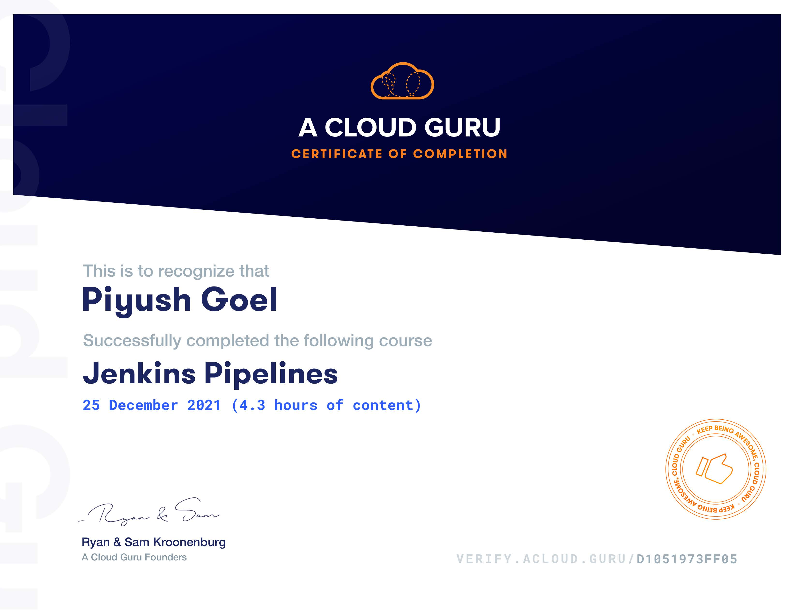

## Jenkins Pipelines
In this course, we will be looking at Jenkins pipelines. We will begin with the basics of pipelines, and the difference between a declarative, and scripted pipeline. We will work with source code management and Jenkinsfiles to automate our pipelines, and see how to use Docker to take our pipelines to the next level.

## Contents
1. What Is a Pipeline?
2. Scripted vs. Declarative Pipelines
3. Automating Pipelines
4. Advanced Jenkinsfiles

[Verify Certificate](https://verify.acloud.guru/D1051973FF05)