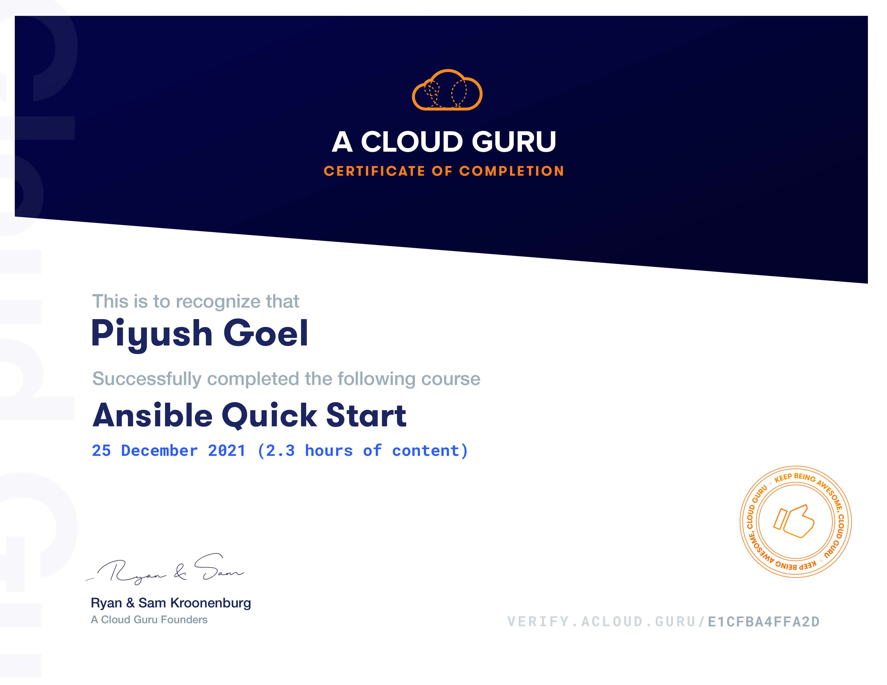

## Ansible Quick Start
Ansible is an automation engine that continues to gain popularity. The tool has become a favorite choice for managing IT infrastructure at scale. This Ansible Quick Start course is designed to get you up and running with the Ansible essentials quickly.
## Contents
1. Ansible Introduction & Architecture.
2. Ansible Installation & Configuration.
3. Ad-hoc Ansible Commands
4. Ansible Playbooks
5. Ansible Variable
6. Trobleshooting and Debugging Ansible
7. Handlers in ANsible

[Verify Certificate](https://verify.acloud.guru/E1CFBA4FFA2D)