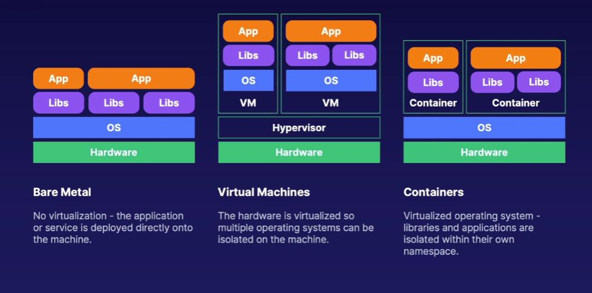

## **What Are Containers?**

In general containers are isolated environment in which you can run your commands, deploy your environments, setup applications etc.

OS-Level virtualization  
Isolated libraries and applications  
Fast to deploy, uses fewer resources. 

### **Benefits**
1. Quick : Few resources need to be installed due to resource being shared with the host operating system.
2. Consistent : All needed libraries and application requirements are packeged with the container.
3. Simple : Deploy using base images. Copy, share and resue environments after configuration.

### **Use Cases**

### **Installation**

### **Launching**

    docker run hello-world

      Hello from Docker!
      This message shows that your installation appears to be working correctly.
      To generate this message, Docker took the following steps:
      1. The Docker client contacted the Docker daemon.
      2. The Docker daemon pulled the "hello-world" image from the Docker Hub.
         (amd64)
      3. The Docker daemon created a new container from that image which runs the
         executable that produces the output you are currently reading.
      4. The Docker daemon streamed that output to the Docker client, which sent it
         to your terminal.
