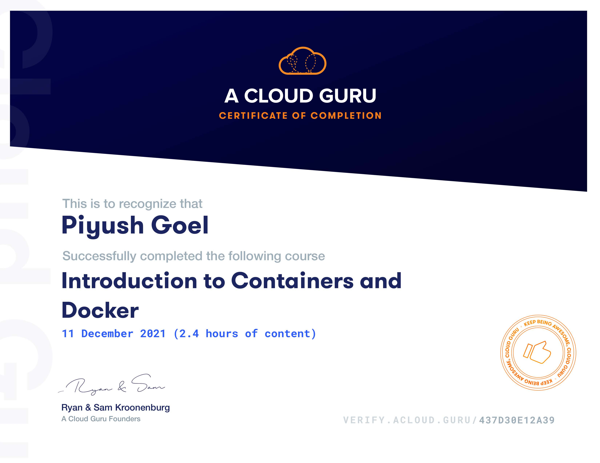

## Introduction to Containers and Docker
Introduction to Containers and Docker leverages the container platform Docker to explore basic container concepts and demonstrates where containers fit in the current technological landscape.

The course begins by providing context around what containers actually are. Next, we reinforce this with practical hands-on learning of the container lifecycle, from deploying to general management to removing and replacing containers as your application or desired container environment changes. We also explore how to deploy our own applications or microservices by learning about container images and how to alter these images to create our own Docker builds.

This course provides a practical understanding of containers and Docker, as well as the foundational skills needed to get started using Docker in your day-to-day workflow.

## Content
1. What is Container?
2. What is Container UseCase
3. Installation
4. Launching Container
5. Accessing the Container
6. Container Manangement
7. Publishing the Container
8. Images
9. Building Dockerfile
10. Image Management
11. Using Docker Hub

[Verify Certificate](https://verify.acloud.guru/437D30E12A39)