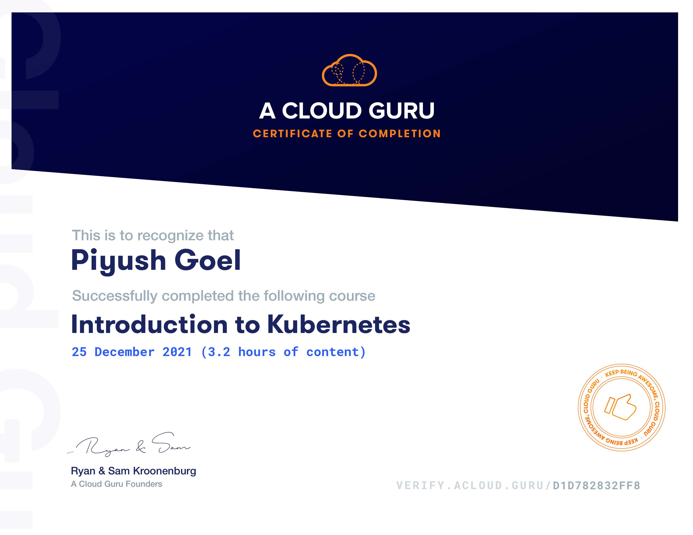

## Introduction to Kubernetes

This course provides a basic introduction to Kubernetes for those who are new to this powerful technology. We will cover the basics of what containers are and what Kubernetes does. You will have the opportunity to build your own Kubernetes cluster and use it to run containers. If you are completely new to Kubernetes, this course can also get you ready to move on to more advanced Kubernetes courses, such as Certified Kubernetes Administrator (CKA).

## Contents
1. Basics
   - What are Containers?
   - What is Kubernetes?
   - Kubernetes Cluster
   - Building a Kubernetes Cluster
2. Working with Kubernetes
   - Kubernetes API
   - Kubernetes Objects
   - kubectl Basics
   - Managing Container with Pods
   - Kubernetes in the cloud.

[Verify Certificate](https://verify.acloud.guru/D1D782832FF8)
