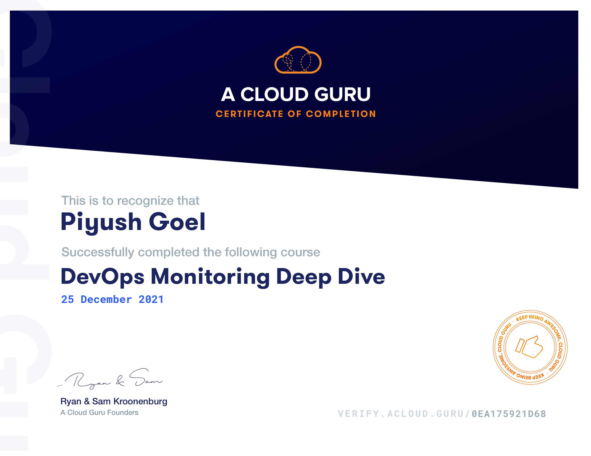

## DevOps Monitoring Deep Dive

In the DevOps Monitoring Deep Dive, we use Prometheus, Alertmanager, and Grafana to demonstrate monitoring concepts that we can use on any monitoring stack. We start by building a foundation of some general monitoring concepts, then get hands-on by working with common metrics across all levels of our platform.

We'll explore infrastructure monitoring by using Prometheus's Node Exporter and viewing statistics about our CPU, memory, disk, file system, basic networking, and load metrics. We'll also take a look at how to monitor any containers we may be using on our virtual machine.

Once our infrastructure monitoring is up and running, we'll take a look at a basic Node.js application and use a Prometheus client library to track metrics across our application.

Finally, we look at how we can get the most out of our metrics by learning how to add recording and alerting rules and then build out a series of routes so any alerts we create can get to their desired endpoint. We'll also look at creating persistent dashboards with Grafana and use its various graphing options to track our data better.
Interactive Diagram: https://interactive.linuxacademy.com/diagrams/ProjectForethought.html
## Contents
1. Creating an Environment
   - Prometheus Setup
   - Alertmanager Setup
   - Grafana Setup
2. Monitoring Basics
   - Push or Pull
   - Pattern and Anti-Pattern
   - Service Discovery
3. Infrastructure Monitoring
   - Node Exporter
   - CPU Metrics
   - Memory Metrics
   - Disk metrics
   - File System Metrics
   - Networking Metrics
   - Load Metrics
   - Using cAdvisor to Monitor Comtainers
4. Application Monitoring
   - Counters
   - Gauges
   - Summaries and Histograms
5. Managing Alerts
   - Recording Rules
   - Alerting Rules
   - For
   - Annotations
   - labels
6. Visualization

[Verify Certificate](https://verify.acloud.guru/0EA175921D68)