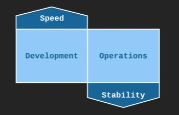

# DevOps and DevOps Culture

## What is DevOps ?

**Dev (Development) + Ops (Operations)**  
"DevOps is a software engineering ***culture*** and ***practice*** that aims at shorter development cycles, increased deployment frequency, more dependable releases, in close alignment with business objectives"

### DevOps is NOT

- DevOps is NOT a **Tool**.
- DevOps is NOT a **Standard**.
- DevOps is NOT a **Product**.
- DevOps is NOT a **Job Title**.

## Agile Software Development

DevOps grew out of the Agile software development movement.  

The traditional way of doing software development was called **WaterFall**. It is focused on long planning phases and doing several month of software development and then a long testing and release cycle.  

**Agile** seeks to develop software in small, frequent cycles in order to deliver functionality to customers quickly.  
Also, It quickly respond to changing business goals.  
It can be difficult to DevOps without Agile and Agile without DevOps.  

In **2007**: Agile software development was gaining popularity, but it was also suffering from a growing divide between development and operations. **Patrick Debois**, an engineer with experience doing both dev and ops saw there are many issues getting in the of releasing software quicky while maintaining stability.

[[TODO]]

## DevOps Culture

DevOps Culture is about **collaboration** between Dev and Ops.

### Under Traditional Model : 
Development and Operations are considered as two seperate entities having opposing goals.

The goal of the development team is to deliver features into the hands of the customer as quickly as possible i.e **Speed** but the goal of the operations team is to maintain the **Stability** of the system and minimize **downtime**.  

These two goals ends up becoming opposition to one another, because one of the worst things for stability is changes. Everytime you change the system you introduced the instability.

The development team is always deploying changes and not really prioritizing stability while the operations team is trying to slow down the development team in order to amintain stability.

**Both Speed and Stability are very important goals**, but the above opposition compromises both of these goals to some degree.

### Under DevOps Culture : 

It is about **collaboration** between Dev and Ops.
They both share the same goal and prioritize speed and stability equally.

#### Goals

- Fast time-to-market(TTM).
- Few production failures.
- Immediate recovery from failures.

## Traditional Silos

In this, the code bounces back and fourth between Dev and QA as QA discovers problems and Dev fix them and finally, it is ready for production. but, If Operation team found some problem. they will throw it back to the Dev.

Problem now is that each group's domain is a black box to the other groups that means the developer don't really have much visibility into the production system and operations have a very little visibility into the code.

## DevOps Silos

When the developer commits their code, this initiates a series of automated steps, automated builds, automated integration, automated testing and eventually automated deployment.

Because all these steps are automated the QAs can get their hands on code almost immediately after the developer write it, which means they can be testing constantly while developer are writing the code.

Once the code is ready to be deployed to production, an automated deployment is kicked off and code gets to production in a consistent and stable manner.

**DevOps Culture is the series of automated steps and the series of tools that enables this process requires collaboration between all of these teams.**

One of the important aspects of all this automation that goes with devops is monitoring. It will inform the team in both successful and failure scenario.
