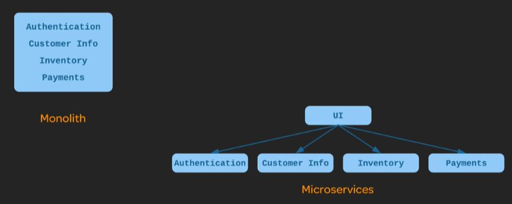

# DevOps Concepts and Practices

## What is build automation ?

It is the process of preparing code for deployment to a live environment in a consistent, automated way using a script ot tool.

It usually looks like running a command-line tool that builds code using configuration files and/or script that are treated as part of the source code.

- Build automation is independent of an IDE ( you can build within the IDE as well as outside the IDE)

## Why do build automation?
- It is **fast**: otherwise needs to be done manually.
- It is **consistent**: the build happens the same way every time. 
- It is **repeatable**: the build can be done multiple times with the same result.
- It os **portable**: the build can be done the same way on any machine.
- It is more **reliable**: their will be fewer bad builds.

## Continuous Integration ?

It is usually done with the help of a CI server.

Eveytime developer commits a code change, the CI server sees the change and automatically performs a build, also executing automated tests.

If there is any problem with the build , the CI server immediately and automatically notified the developer.

### Advantages of Continuous Integration

- **Early Detection** of certain type of bugs : compile and automated test fails.
- **Eliminate the scramble** to integrate just before a big release : 
- Makes **frequent releases** possible : Code is always ina state that can be deployed to production.
- Makes **continuous testing** possible : QA tester can get their hands on
- Encourages **good coding practices** : Frequent commits encourages simple, modular code.

## Continuous Delivery and Continuous Deployment

**Continuous Delivery** is maintaining the code in a deployable state. 
Regardless of whether or not the decision is made to deploy, the code is always in the state that is able to be deployed. 
That means that the decision of whether or not to deply is purely a business decision.

**Continuous Deployment** is actually doing the deployment frequently.

### Why do Continuous delivery and Continuous Deployment?

- Faster time-to-market : features into the hands of customers more quickly
- Fewer problems caused by the deployment process :  problems with the process are more easily discovered.
- Lower risk : Frequent deployments of only a few changes are less risky.
- Reliable rollbacks :
- Fearless deployments : ability to rollback quickly.

## Infrastructure as Code (IaC) 

It means managing and provisioning infrastrucutre through code and automation.  
Instead of doing things manually, you can automation and code to create and change:
- Servers
- Instances
- Environments
- Containers
- Other infrastructure

### Without Infrastrucutre as code you might
- SSH into the host.
- Issue a series of commands to perform the changes.

### With Infrastrucutre as code
- Change some code or configuration files that can be used with an automation tool to perform the changes.
- You then Commit those chnages to source control.
- Use an automation tool to enact the changes defined in the code and/or configuration files.

### Why do infrastructure as code ?
- **Consistency** in creation and management of resources. - The same automation will run the same way every time.
- **Reusability** - Code can be used to make the same changes consistently across multiple hosts.
- **Scalability** - Need a new instance? You can have one configured exactly the same way as the existing instances.
- **Self-documenting** - The way a server is configured can be viewed in source control, rather than being a matter of who logged into the server and did something.
- **Simplify the complexity** - Complex infrastrucutres can be stood up quickly once they are defined as code.

## Configuration Management

It means maintaining and changing the state of pieces of infrastrucutre in a consistent, maintainable, and stable way.

Changes always need to happen - configuration management is about doing them in a maintainable way.

Configuration management allows you to minimize **configuration drift**.

### Example - You need to upgrade a software package on bunch of servers:
Without good configuration management - you have to login into each server and perform the upgrade. Perhaps one server was missed due to poor documentation, causing a lot of downtime while you do the upgrade.

With good configuration management - you define the new version of the software package in a configuration file or tool and automatically roll out the change to all of the servers.

**Configuration management is about managing your configuration somewhere outside of the servers themselves.**

### Why do configuration management?

- **Save time** : It takes less time to change the configuration.
- **Insight** : 
- **Maintainability** : A more maintainable infrastrucutre is easier to change in a stable way.
- **Less configuration drift** : It is easier to keep a standard configuration across a multitude of hosts.

## What is Orchestration?
It is an automation that supports processess and workflows, such as provisioning resources.
It is less like being a builder and more like conducting an orchestra.

Example :-

A customer requests more resources for a web service that is about to see  a heavy increase in usage due to a planned marketing effort.

Instead of manually standing up new nodes, operaions engineers use an orchestration tool to request five more nodes to support the service.

A few minutes later, the tool has five new nodes are up and running.

Example 2:-

A monitoring tool detects an increased load on the service.

An orchestration tool responds to this by spinning up additional resources to handle the load.

When the load decreases again, the tool spins the additional resources back down, freeing them up to be used by something else.

This how **Netflix** handles their resource provisioning.

### Why do orchestration?

- **Scalability** : Resource can be quickly incresed or decresed to meet the changing needs.
- **Stability** : Automation tools can automatically respond to fix problems before users see them.
- **Save time** : Certain tasks and workflows can be automated, feering up engineers time.
- **Self-service** : Orchestration can be used to offer resources to customers in a self-service fashion.
- **Granular insight into resources usage** : Orchestration tools give greater insight into how many resources are being used by what software, services, or customers.

**Orchestration is a powerful practice**. 
It can allow us to scale up and scale down in response to rapidly changing business needs.  
It allows us to create self-healing environments taht are able to automatically recover from faults and failure and generally give you much greater stability.

## What is Monitoring?
The Collection and presentataion of data about the performance and stability of services and infrastructure. 
The Collected data is presented in various forms such as charts and graphs or in the form of real-time notifications about the problems.

Example 1:-  
Performance on the website is begining to slow down. A monitoring tool detects that response times are growing. An administrator is immediately notified and is able to intervene before downtime occurs.

Example 2:-  
Something went wrong in production last night. it's working now, but we don't know what caused it. 
Luckily, monitoring tools collected a lot of data during the outage.
With that data, developers and operations engineers are able to determine the root cause (a poorly performing SQL query) and fix it. 

### Why do Monitoring?

- **Fast recovery**- The Sooner a problem is detected, the sooner it can be fixed.
- **Better root cause analysis** - The more data you have, the easier it is to determine the root cause of the problem
- **Visibility across teams** - Good monitoring tools give useful data to both developers and operations people about the performance of the code in production.
- **Automated response** - Monitoring data can be used alongside orchestration to provide automated responses to events, such as automated recovery from failures.

## Microservices
A microservice architecture breaks an application up into a collection of small, loosely-coupled services.  
Different Microservices interact with each other using stable and well defined APIs. It means they are independent of one another.  
Each of these has its own codebase and seperate running process. They all can be built, deployed and scaled separately.

### Microservices vs Monolith

### Why use Microservices?
- Modularity :
- Technological flexibility :
- Optimized Scalability : 

## DevOps Pipeline (Hands On)

[[TODO]]