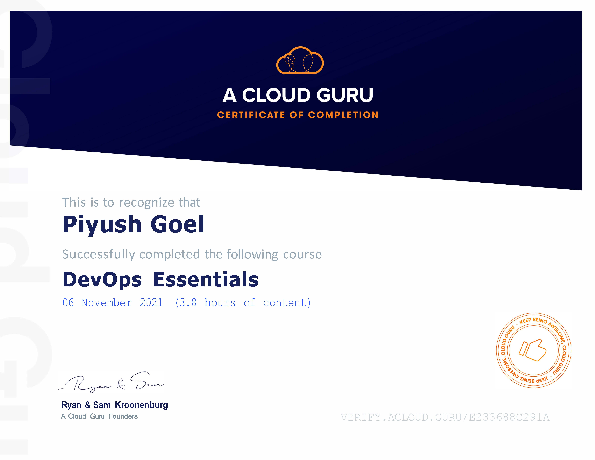

# DevOps Essential
This course provides a basic introduction to the concept of DevOps. It seeks to give the student a working knowledge of what DevOps is and how it impacts IT in the real world. This course explains the culture of DevOps as well as some of the main practices and tools associated with DevOps. It also introduces the student to the close relationship between DevOps and the cloud.

## Content
1 What is DevOps?
2 DevOps Culture
3 DevOps ConCept and Practices
4 DevOps Tools
5 Devops and the cloud

[Verify Certificate](https://verify.acloud.guru/E233688C291A)
